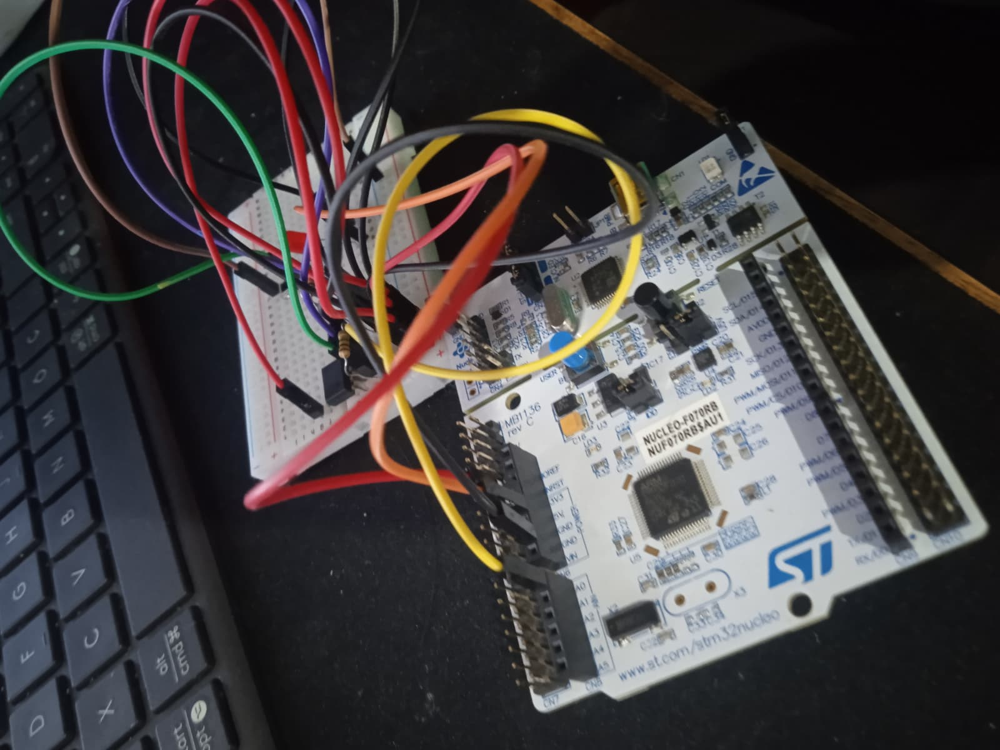
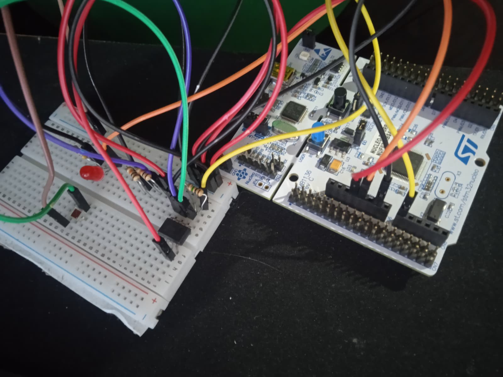
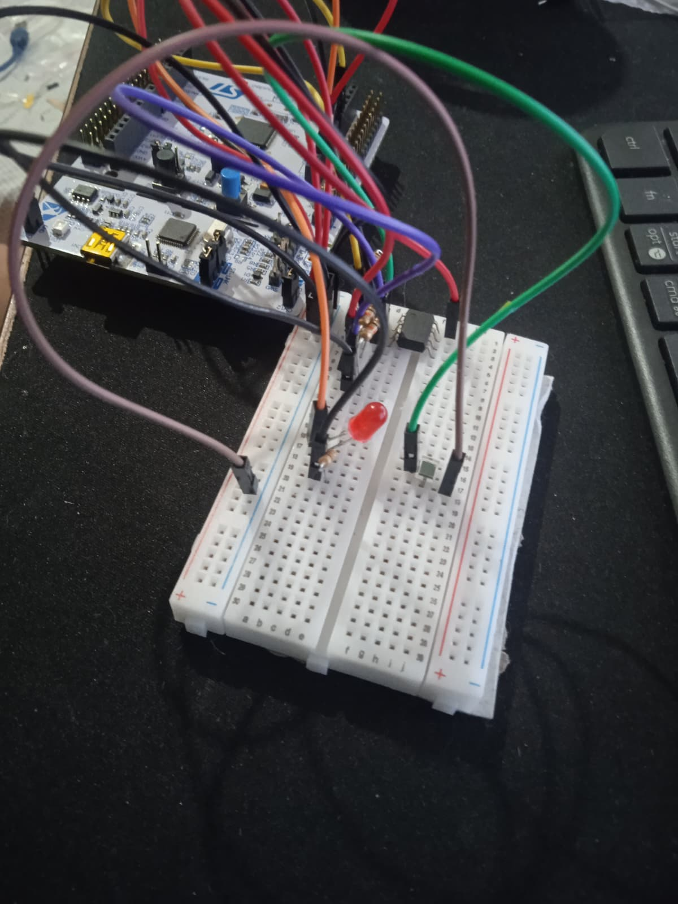

# HeartRateSensor

**Bare-metal heart rate monitor on STM32 Nucleo-F070RB (ARM Cortex-M0)**  
No HAL. No RTOS. No Arduino. Direct CMSIS register writes — from analog circuit to stable BPM output over serial.

> University project for Advanced Microprocessors — built to understand what the abstraction layers hide.

---

## Result

Finger on sensor → `BPM: 72` on the serial terminal. Stable within ±5 BPM of a reference pulse oximeter over 30 seconds.

```
--- HeartRateSensor Phase 4 ---
STATE: RISING
STATE: PEAK_HOLD
BPM: 71
STATE: REFRACTORY
STATE: FALLING
STATE: IDLE
STATE: RISING
STATE: PEAK_HOLD
BPM: 72
```

---

## Signal Chain

```
Finger
  │
  ▼
940nm IR LED  ──►  BPW34 Photodiode  ──►  LM358 Op-Amp (5V rail)
                                               │
                                               ▼
                                         PA0 (ADC_IN0)
                                               │
                              TIM3 TRGO @ 100 Hz (hardware trigger)
                                               │
                                               ▼
                                    ADC1 ISR (EOC interrupt)
                                    g_adc_sample / g_adc_ready
                                               │
                                               ▼
                                    algorithm_process()
                                    ┌──────────────────────┐
                                    │ 1. Invert + MA filter │
                                    │ 2. Adaptive threshold │
                                    │ 3. Refractory gate    │
                                    │ 4. BPM rolling avg    │
                                    └──────────────────────┘
                                               │
                                               ▼
                                   USART2 TX → "BPM: NN\r\n"
                                   115200 baud, ST-Link virtual COM
```

---

## Hardware

| Component | Part | Role |
|-----------|------|------|
| MCU | STM32 Nucleo-F070RB | ARM Cortex-M0, 8 MHz HSI |
| IR LED | 940 nm emitter | Illuminates finger |
| Photodiode | BPW34 | Detects reflected IR |
| Op-amp | LM358 (5V rail) | Amplifies µA photodiode current to ADC range |
| Programmer | ST-Link v2 (on-board) | Flash + virtual COM port via USB |

**Note on LM358 supply:** The LM358 output saturates at ~1.8 V on a 3.3 V supply, giving only ~44% of the 12-bit ADC range. Running it on the 5 V USB rail gives full swing and a usable PPG amplitude.

### Circuit Photos

| Breadboard | Signal on Serial |
|------------|-----------------|
|  |  |

---

## Firmware Architecture

```
main.c
├── systick_init()      → SysTick @ 1ms (millis() source)
├── usart2_init()       → PA2/PA3 AF1, 115200 baud, polling TX
├── tim3_init()         → TIM3 TRGO @ 100Hz hardware trigger
├── adc_init()          → ADC1 on PA0, EOC interrupt, HSI14 clock
└── algorithm_init()    → zero all signal-processing state

while(1):
    if g_adc_ready → algorithm_process(g_adc_sample)

ADC1_IRQHandler:
    g_adc_sample = ADC1->DR & 0x0FFF
    g_adc_ready  = 1
```

### Driver Layer

| File | Peripheral | Key registers |
|------|-----------|---------------|
| `systick.c` | SysTick | `SYST_RVR`, `SYST_CSR` via `SysTick_Config()` |
| `usart.c` | USART2 | `RCC->AHBENR`, `GPIOA->MODER/AFR`, `USART2->BRR/CR1/ISR/TDR` |
| `tim3.c` | TIM3 | `TIM3->PSC/ARR/CR2/CR1` |
| `adc.c` | ADC1 | `RCC->CR2` (HSI14), `ADC1->CFGR1/SMPR/CHSELR/IER/CR/ISR/DR` |
| `algorithm.c` | — | No peripheral registers (by design) |

---

## How It Works

### 1. Analog Front End

Reflective photoplethysmography (PPG): the IR LED illuminates the fingertip; the BPW34 detects the tiny variation in reflected IR intensity caused by pulsatile blood flow. Each heartbeat slightly increases blood volume in the capillaries, absorbing marginally more IR light — producing a ~1–5% amplitude variation the op-amp must amplify to ADC-readable levels.

The LM358 acts as a transimpedance amplifier (current → voltage), converting the photodiode's µA-range photocurrent into a 0–VCC voltage swing.

### 2. Hardware-Triggered ADC at Exactly 100 Hz

TIM3 generates a TRGO (trigger output) pulse on every Update Event at exactly 100 Hz:

```
PSC = 79  →  counter clock = 8 MHz / 80 = 100 kHz
ARR = 999 →  update rate   = 100 kHz / 1000 = 100 Hz
CR2  = TIM_CR2_MMS_1   →  MMS[2:0] = 010 = Update → TRGO
```

ADC1 is configured with `EXTSEL[2:0] = 011` (TIM3_TRGO) and `EXTEN = 01` (rising edge). This means the ADC fires deterministically with zero software jitter — the hardware trigger chain is entirely autonomous.

```c
ADC1->CFGR1 = ADC_CFGR1_EXTSEL_0 | ADC_CFGR1_EXTSEL_1  /* EXTSEL=011 → TIM3_TRGO */
            | ADC_CFGR1_EXTEN_0;                          /* EXTEN=01  → rising edge */
```

**Critical detail:** The F070 ADC uses a dedicated 14 MHz RC oscillator (HSI14) — separate from the system clock. It must be started and stable before `ADEN` is set:

```c
RCC->CR2 |= RCC_CR2_HSI14ON;
while (!(RCC->CR2 & RCC_CR2_HSI14RDY));
// then: ADCAL → configure → ADEN → ADSTART
```

### 3. Signal Processing Algorithm

The raw PPG signal is **inverted** in software (`inv = 4095 - sample`) because the LM358 amplifier inverts the photodiode current: more light (peak blood volume) → higher photodiode current → lower op-amp output voltage → lower ADC reading. The algorithm works on the corrected orientation.

#### Stage 1 — 32-Sample Moving Average (SIG-01)

```c
s_ma_sum -= s_ma_buf[s_ma_idx];
s_ma_buf[s_ma_idx] = inv;
s_ma_sum += inv;
s_ma_idx = (s_ma_idx + 1) & 0x1F;   // modulo 32 via bitmask — no division
uint16_t filtered = (uint16_t)(s_ma_sum >> 5);
```

Integer-only. Shift replaces division. The 32-sample window at 100 Hz gives 320 ms of smoothing — enough to attenuate high-frequency noise without smearing the ~800 ms heartbeat envelope.

#### Stage 2 — Adaptive Threshold Peak Detector (SIG-02, SIG-03)

A five-state machine:

```
IDLE → RISING → PEAK_HOLD → REFRACTORY → FALLING → IDLE
```

- **IDLE**: waits for `filtered > s_threshold`
- **RISING**: tracks maximum; detects peak crest via 20-count hysteresis
- **PEAK_HOLD**: registers beat, timestamps peak, updates threshold, starts refractory
- **REFRACTORY**: 350 ms lockout — suppresses the dicrotic notch (secondary pressure wave that mimics a second heartbeat)
- **FALLING**: waits for signal to drop below threshold before accepting next cycle

#### Stage 3 — BPM Calculation + Rolling Average (SIG-04, SIG-05)

```c
uint32_t interval_ms = now - s_last_peak_ms;
uint32_t bpm = 60000UL / interval_ms;          // integer divide, no float

if (bpm >= 40 && bpm <= 200) {                 // physiological bounds check
    s_bpm_buf[s_bpm_idx] = (uint16_t)bpm;
    // ... rolling average over last 5 valid readings
}
```

The 5-reading rolling average smooths single-beat jitter. A BPM value outside 40–200 is silently discarded without corrupting the buffer — stale values never print.

---

## Build & Flash

**Requirements:** STM32CubeIDE 1.15+ with the STM32F0 device pack installed.

1. Clone this repository
2. In STM32CubeIDE: **File → Import → Existing Projects into Workspace** → select the repo root
3. Build: **Project → Build All** (or `Ctrl+B`)
4. Flash: connect Nucleo-F070RB via USB, then **Run → Debug** (ST-Link GDB server)
5. Open a serial terminal at **115200 baud, 8N1** on the ST-Link virtual COM port
6. Place finger firmly on the PPG sensor and observe output

**Toolchain:** `arm-none-eabi-gcc` (bundled with CubeIDE), OpenOCD/ST-Link GDB server (bundled)

---

## Debug Modes

Three compile-time toggles at the top of `main.c` / `algorithm.c`:

| Define | Effect | How to enable |
|--------|--------|---------------|
| `CALIBRATION_MODE` | 5-second startup window: prints `CAL min=NNN max=MMM amp=PPP n=QQQ` | Uncomment `/* #define CALIBRATION_MODE */` in `main.c` |
| `DEBUG_STATE` | Prints state machine transitions: `STATE: RISING`, `STATE: PEAK_HOLD`, etc. | Defined by default in `main.c` |
| `DEBUG_VERBOSE` | Per-sample dump: `RAW / FILT / THR / AMP / STATE` on every ADC sample | Uncomment `/* #define DEBUG_VERBOSE */` in `main.c` |

`CALIBRATION_MODE` is used to empirically measure the PPG signal amplitude before setting `FINGER_MIN_AMPLITUDE` — essential for tuning the no-finger detection threshold.

---

## Key Technical Decisions

| Decision | Choice | Rationale |
|----------|--------|-----------|
| ADC trigger | TIM3 TRGO hardware trigger | Software trigger via SysTick ISR introduces jitter; BPM timing accuracy requires sub-ms precision |
| ADC result | EOC interrupt (ADC1_IRQn) | Single-channel 100 Hz ISR costs <1% CPU; DMA adds setup complexity without benefit |
| USART TX | Polling (TXE flag) | BPM output is ~15 chars at ~1 Hz; polling completes in <150 µs; ring buffer overhead not justified |
| millis() source | SysTick | Dedicated core timer; no peripheral timer consumed |
| Arithmetic | Integer-only | Cortex-M0 has no FPU; `float` silently uses soft-float library (large, slow) |
| Signal inversion | `inv = 4095 - sample` in software | LM358 transimpedance amplifier inverts the photodiode current; algorithm works on corrected signal |
| HAL | None | Direct CMSIS register writes — educational goal is understanding the hardware, not the abstraction |

---

## STM32F070 Gotchas

These are non-obvious differences from the more commonly documented F103 that caused the most debugging time:

| Gotcha | Detail |
|--------|--------|
| GPIO clock is on AHB | `RCC->AHBENR \|= RCC_AHBENR_GPIOAEN` — not APB2ENR like F1 |
| USART registers renamed | F0 uses `ISR` (status) and `TDR` (transmit). F1 uses `SR` and `DR`. Mixing them compiles but silently writes wrong registers |
| ADC has dedicated HSI14 clock | Must enable `RCC->CR2 \|= RCC_CR2_HSI14ON` and wait for `HSI14RDY` before `ADEN` |
| ADC calibration is mandatory | Run `ADCAL` with `ADEN=0` before first conversion. Skipping gives random DC offset with no error flag |
| Single APB — no timer clock doubling | F070 has one APB. TIM3 clock = PCLK directly. F103 APB1 timers get ×2 multiplier — wrong PSC/ARR values if ported from F103 code |
| ADC1_IRQn — no shared vector | F070 has only ADC1. F103 uses `ADC1_2_IRQn` (shared with ADC2) |
| EXTSEL value for TIM3_TRGO | `EXTSEL[2:0] = 011` on F070. Setting this wrong = ADC never fires, no error flag, silent failure |

---

## Project Structure

```
HeartRateSensor/
├── Src/
│   ├── main.c          # Init sequence + main loop + CALIBRATION_MODE
│   ├── algorithm.c     # Signal processing: MA filter, peak detector, BPM
│   ├── adc.c           # ADC1 init + ADC1_IRQHandler
│   ├── tim3.c          # TIM3 100 Hz TRGO
│   ├── usart.c         # USART2 init + uart_write_str/u32
│   └── systick.c       # SysTick 1ms + millis()
├── Inc/
│   ├── algorithm.h
│   ├── adc.h
│   ├── tim3.h
│   ├── usart.h
│   └── systick.h
├── Drivers/            # CMSIS headers (STM32F0xx device pack)
└── STM32F070XBTX_FLASH.ld  # Linker script
```

---

## Hardware Photos




---

## License

MIT
